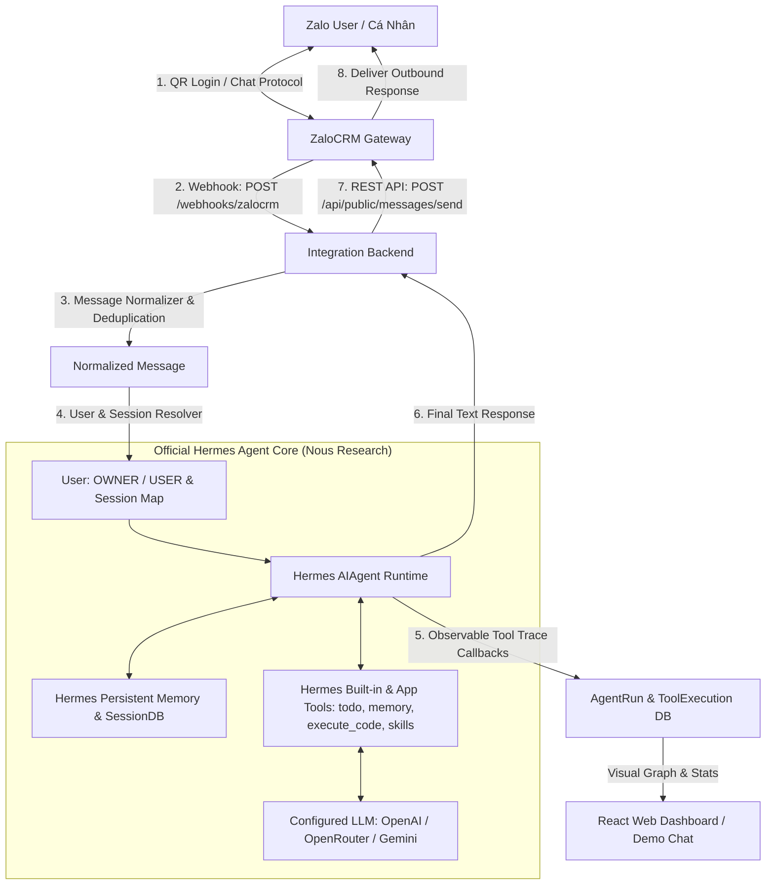

# KIẾN TRÚC HỆ THỐNG AI PERSONAL ASSISTANT (HERMES AGENT + ZALOCRM GATEWAY)

## 1. TỔNG QUAN HỆ THỐNG
Hệ thống kết hợp giữa:
- **ZaloCRM Gateway (`locphamnguyen/ZaloCRM`)**: Đảm nhiệm toàn bộ hạ tầng giao tiếp Zalo cá nhân (Đăng nhập QR, lưu session, reconnect, nhận/gửi tin nhắn qua Webhook & REST API).
- **Official Hermes Agent (`Nous Research`)**: Đóng vai trò là **Bộ não AI duy nhất** của hệ thống (ReAct Loop, Memory, Tools, Skills, RBAC).
- **FastAPI Integration Layer**: Cầu nối chuẩn hóa dữ liệu giữa ZaloCRM và Hermes Agent.

---

## 2. SƠ ĐỒ LUỒNG DỮ LIỆU ĐẦY ĐỦ (END-TO-END FLOW)

---

## 3. PHÂN VAI TỪNG THÀNH PHẦN

| Thành phần | Công nghệ / Nguồn | Trách nhiệm chính |
| :--- | :--- | :--- |
| **Zalo Messaging Gateway** | `locphamnguyen/ZaloCRM` | Quản lý kết nối Zalo cá nhân, đăng nhập QR, giữ session, bắn webhook và nhận lệnh gửi tin qua REST API. **Không can thiệp vào AI**. |
| **Core AI Agent Brain** | `NousResearch/hermes-agent` | Hiểu ngôn ngữ tự nhiên, chạy vòng lặp ReAct, lưu và truy xuất bộ nhớ, thực thi các công cụ số học, quản lý task và tạo phản hồi cuối cùng. |
| **Integration Backend** | FastAPI / Async SQLAlchemy | Tiếp nhận webhook ZaloCRM, verify HMAC, deduplicate tin nhắn, map session theo từng Zalo User, lưu trace thực thi và gọi API gửi tin. |
| **Web Dashboard** | React 18 + TypeScript + Vite | Demo Chat giả lập, trực quan hóa cây quyết định suy luận (Live Trace Visualizer), quản lý bộ nhớ, task và theo dõi trạng thái ZaloCRM. |

---

## 4. BẢO MẬT & PHÂN QUYỀN (RBAC)
- **Xác thực Webhook**: ZaloCRM ký HMAC-SHA256 trên từng payload gửi sang Backend (`X-Webhook-Signature`).
- **Xác thực REST API**: Backend gửi tin nhắn qua ZaloCRM với header `X-API-Key`.
- **Phân quyền Chủ nhân (`OWNER`) vs Khách (`USER`)**: Được tiêm trực tiếp vào System Prompt của Hermes và thẩm định chặt chẽ ở tầng Backend trước khi thực thi các lệnh quản trị nhạy cảm.
