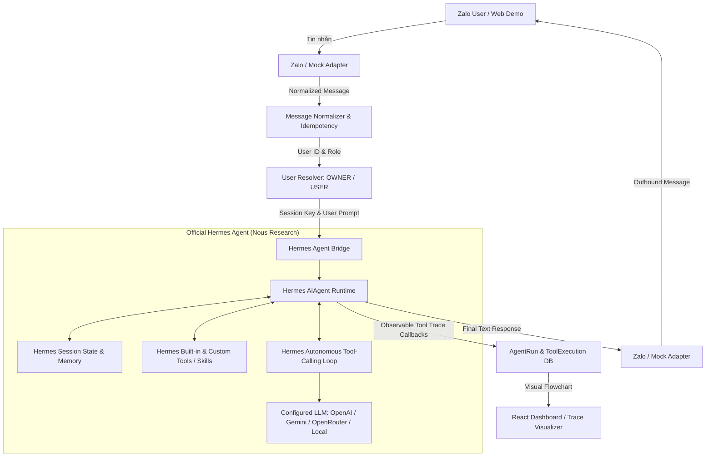

# KẾ HOẠCH DI TRÚ SANG OFFICIAL HERMES AGENT (NOUS RESEARCH)
# File: HERMES_MIGRATION_PLAN.md

## 1. TỔNG QUAN MỤC TIÊU
Loại bỏ hoàn toàn AI Agent tự code (custom loop, custom memory, custom tool registry) và thay thế 100% bằng **Hermes Agent chính thức của Nous Research** (`https://github.com/NousResearch/hermes-agent`).

Hermes Agent trở thành **Core AI Agent runtime duy nhất** của hệ thống. Backend FastAPI đóng vai trò integration layer kết nối giữa Zalo/Web và Hermes Agent.

---

## 2. PHÂN LOẠI CÁC THÀNH PHẦN (KEEP / REMOVE / REPLACE / ADAPT)

### 2.1. KEEP (Giữ lại)
- **Zalo Integration Layer**:
  - `backend/app/channels/zalo/adapter.py`, `client.py`, `schemas.py`: Xử lý Webhook Zalo OA, xác thực chữ ký, chuẩn hóa tin nhắn, gửi phản hồi qua Zalo OpenAPI v3.
  - `backend/app/channels/mock/adapter.py`: Mock Chat Adapter cho Web Demo.
  - `backend/app/channels/base.py`: Interface `MessagingChannelAdapter`.
- **API & Webhook Entrypoints**:
  - `backend/app/api/routes/webhook.py`: Endpoint `POST /webhooks/zalo`.
  - `backend/app/api/routes/demo.py`: Endpoint `POST /api/demo/messages`.
  - `backend/app/api/routes/health.py`: Healthcheck.
- **Database & Observable Models**:
  - `backend/app/db/database.py`: Async database engine.
  - `backend/app/models/user.py`: Lưu trữ User và phân quyền `OWNER` vs `USER`.
  - `backend/app/models/task.py`, `note.py`: Lưu trữ tasks/notes phục vụ ứng dụng.
  - `backend/app/models/agent_run.py`, `tool_execution.py`: Lưu trace thực thi của Hermes Agent để trực quan hóa trên Dashboard.
- **Frontend Dashboard (React + TypeScript + Vite)**:
  - Giữ lại toàn bộ giao diện Dashboard, Demo Chat, Agent Runs Trace Visualizer, Memory, Tasks, Tools, Channels, Settings.
- **Docker & Config**:
  - `docker-compose.yml`, `backend/Dockerfile`, `frontend/Dockerfile`.

---

### 2.2. REMOVE (Xóa bỏ hoàn toàn)
- ❌ `backend/app/agent/loop.py`: Vòng lặp Agent ReAct tự code.
- ❌ `backend/app/agent/context_builder.py`: Tự lắp ráp context thủ công.
- ❌ `backend/app/agent/prompts.py`: System prompt tự code.
- ❌ `backend/app/memory/long_term.py`: Bộ nhớ dài hạn tự code.
- ❌ `backend/app/memory/short_term.py`: Bộ nhớ ngắn hạn tự code.
- ❌ `backend/app/memory/vector_store.py`: Vector store tự code.
- ❌ `backend/app/memory/manager.py`: Memory manager tự code.
- ❌ `backend/app/tools/registry.py`: Tool registry tự code làm orchestrator.

---

### 2.3. REPLACE_WITH_HERMES (Thay thế bằng Hermes Agent chính thức)
- ✅ **Core Agent Runtime**: Sử dụng trực tiếp `AIAgent` từ `vendor/hermes-agent/run_agent.py` và `vendor/hermes-agent/agent/`.
- ✅ **Agent Loop**: Sử dụng Hermes Autonomous Loop (`agent/conversation_loop.py`, `agent/tool_executor.py`).
- ✅ **Hermes Memory & Skills**: Sử dụng cơ chế Memory / Skills / Session của Hermes (`hermes_state.py`, `agent/memory_manager.py`).
- ✅ **Hermes Session DB**: Quản lý phiên hội thoại và phân tách context giữa các user qua Hermes Session Management.

---

### 2.4. ADAPT_TO_HERMES (Điều chỉnh để tích hợp với Hermes)
- 🔄 **Hermes Bridge (`backend/app/agent/hermes_service.py`)**:
  - Tiếp nhận Normalized Message từ Zalo/Mock.
  - Khởi tạo/tái sử dụng instance `AIAgent` của Hermes theo `session_id` (gắn với `zalo_user_id` hoặc `mock_user_id`).
  - Truyền metadata người dùng (`OWNER` vs `USER`) vào Hermes System Context.
  - Thu thập observable callbacks (`tool_start_callback`, `tool_complete_callback`, `status_callback`) từ Hermes để ghi lại `AgentRun` và `ToolExecution` cho Web Dashboard.
  - Trả về câu trả lời cuối cùng để gửi lại Zalo.
- 🔄 **Application Tools / Skills**:
  - Expose các công cụ ứng dụng (quản lý task, ghi chú, tính toán) tương thích với hệ thống tool của Hermes.

---

## 3. KIẾN TRÚC CUỐI CÙNG (FINAL HERMES-FIRST ARCHITECTURE)

---

## 4. LỘ TRÌNH THỰC HIỆN TỪNG BƯỚC (STEP-BY-STEP)

1. **Bước 1**: Cài đặt gói `hermes-agent` vào môi trường Python 3.12 (`./backend/.venv/bin/pip install -e vendor/hermes-agent`).
2. **Bước 2**: Xác minh Hermes Agent chạy standalone thành công (Prompt ➔ Hermes ➔ Response).
3. **Bước 3**: Cấu hình Model/Provider (OpenAI, Gemini, OpenRouter, Local).
4. **Bước 4**: Xây dựng `HermesService` (Bridge) thay thế hoàn toàn orchestrator cũ.
5. **Bước 5**: Kết nối Demo Chat và Zalo Adapter với Hermes Agent.
6. **Bước 6**: Kiểm tra phân quyền `OWNER` vs `USER` qua Hermes context.
7. **Bước 7**: Kiểm tra Memory và Session Isolation của Hermes Agent.
8. **Bước 8**: Tích hợp các Tool/Skill (Tasks, Notes, Math) vào Hermes.
9. **Bước 9**: Cập nhật Observable Trace cho Dashboard.
10. **Bước 10**: Xóa bỏ các file custom agent cũ không còn dùng.
11. **Bước 11**: Chạy bộ kiểm thử (Pytest) xác minh 100% kịch bản.
12. **Bước 12**: Cập nhật `README.md` và tài liệu.
