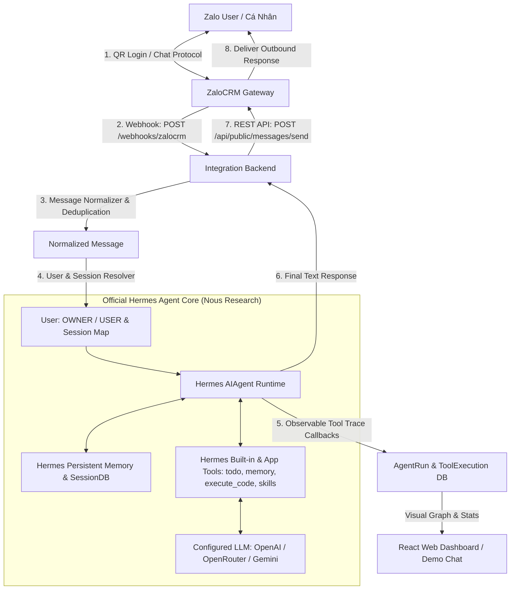

# 🤖 AI Personal Assistant 24/7 (Official Hermes Agent + ZaloCRM Gateway)

> **Dự án Khóa luận Tốt nghiệp Đại học**: Xây dựng Prototype Trợ lý AI Cá nhân (AI Personal Assistant) chạy 24/7 sử dụng **Official Hermes Agent từ Nous Research** làm Core AI Agent Runtime duy nhất, kết hợp **ZaloCRM Gateway (`locphamnguyen/ZaloCRM`)** làm hạ tầng kết nối Zalo cá nhân (QR Login, session persistence, send/receive message).

---

## 📑 MỤC LỤC
1. [Kiến trúc & Phân vai hệ thống](#1-kiến-trúc--phân-vai-hệ-thống)
2. [Sơ đồ luồng dữ liệu (Mermaid)](#2-sơ-đồ-luồng-dữ-liệu)
3. [Cấu trúc mã nguồn](#3-cấu-trúc-mã-nguồn)
4. [Hướng dẫn Khởi chạy & Vận hành](#4-hướng-dẫn-khởi-chạy--vận-hành)
5. [Cấu hình biến môi trường (.env)](#5-cấu-hình-biến-môi-trường)
6. [Kịch bản Demo Khóa luận (Zalo & Web Console)](#6-kịch-bản-demo-khóa-luận)
7. [Chạy Automated Test Suite (Pytest)](#7-chạy-automated-test-suite)

---

## 1. KIẾN TRÚC & PHÂN VAI HỆ THỐNG

- **ZaloCRM Gateway (`locphamnguyen/ZaloCRM`)**:
  - Đăng nhập Zalo cá nhân bằng mã QR.
  - Tự động duy trì phiên đăng nhập và kết nối lại (reconnect).
  - Nhận tin nhắn đến và phát Webhook HTTP POST (`POST /webhooks/zalocrm`).
  - Gửi tin nhắn phản hồi qua Public REST API (`POST /api/public/messages/send`).
  - *Lưu ý*: Hoàn toàn bypass/disable AI tích hợp sẵn của ZaloCRM.
- **Core AI Agent (`NousResearch/hermes-agent`)**:
  - Bộ não AI duy nhất (`AIAgent`, `agent/conversation_loop.py`).
  - Tự chủ quyết định vòng lặp ReAct và thực thi công cụ (`todo`, `memory`, `execute_code`, `session_search`, `skills`...).
  - Quản lý Session DB và bộ nhớ dài hạn theo từng Zalo User.
- **Backend Integration (FastAPI)**:
  - Tiếp nhận Webhook từ ZaloCRM, kiểm tra chữ ký HMAC-SHA256, chống trùng lặp tin nhắn.
  - Phân quyền `OWNER` (Chủ nhân/Sếp) và `USER` (Khách/Người dùng thông thường).
  - Thu thập observable callbacks của Hermes để trực quan hóa cây suy luận trên Web Dashboard.

---

## 2. SƠ ĐỒ LUỒNG DỮ LIỆU



---

## 3. CẤU TRÚC MÃ NGUỒN

```
.
├── vendor/
│   ├── hermes-agent/              # Official Hermes Agent codebase (Nous Research)
│   └── ZaloCRM/                   # Official ZaloCRM Gateway (locphamnguyen/ZaloCRM)
├── backend/
│   ├── app/
│   │   ├── main.py                # FastAPI App
│   │   ├── agent/
│   │   │   ├── hermes_service.py  # Hermes AIAgent Bridge & Session Manager
│   │   │   └── orchestrator.py    # Pipeline dispatcher
│   │   ├── channels/
│   │   │   ├── zalocrm/           # ZaloCRM Adapter & Client (REST + Webhook)
│   │   │   └── mock/              # Mock Chat Adapter cho Web Demo
│   │   ├── api/routes/
│   │   │   ├── zalocrm_webhook.py # POST /webhooks/zalocrm
│   │   │   ├── demo.py            # POST /api/demo/messages
│   │   │   └── stats.py           # Dashboard stats & status
│   │   └── tests/                 # 18 Test Cases (Pytest)
├── frontend/                      # React + TypeScript + Vite Dashboard
├── docs/
│   └── ZALOCRM_INTEGRATION.md     # Tài liệu kỹ thuật tích hợp ZaloCRM
├── ZALOCRM_MIGRATION_PLAN.md      # Kế hoạch di trú ZaloCRM
├── ARCHITECTURE.md
└── docker-compose.yml
```

---

## 4. HƯỚNG DẪN KHỞI CHẠY & VẬN HÀNH

### Bước 1: Khởi động Backend (FastAPI + Hermes Agent)
```bash
source backend/.venv/bin/activate
PYTHONPATH=backend:vendor/hermes-agent python3 backend/app/main.py
```
> API chạy tại: **`http://localhost:8000`** (Swagger: `http://localhost:8000/docs`)

### Bước 2: Khởi động Web Dashboard
```bash
cd frontend
npm run dev
```
> Dashboard truy cập tại: **`http://localhost:5173`**

### Bước 3: Khởi động ZaloCRM (Tùy chọn khi kết nối tài khoản Zalo thật)
```bash
cd vendor/ZaloCRM
docker compose up -d
# Đăng nhập ZaloCRM tại http://localhost:3080 và quét mã QR Zalo cá nhân.
# Cấu hình Webhook trong ZaloCRM trỏ tới: http://backend:8000/webhooks/zalocrm
```

---

## 5. CẤU HÌNH BIẾN MÔI TRƯỜNG (.env)

```env
# LLM Provider ("mock" cho demo offline, hoặc "openai", "gemini", "openrouter")
LLM_PROVIDER=mock
OPENAI_API_KEY=
OPENAI_MODEL=gpt-4o-mini

# Chủ nhân / Sếp
OWNER_NAME=Chủ nhân
OWNER_ZALO_ID=owner_zalo_id_example

# ZaloCRM Gateway
ZALOCRM_BASE_URL=http://localhost:3000
ZALOCRM_API_KEY=your_api_key_from_zalocrm
ZALOCRM_WEBHOOK_SECRET=your_webhook_secret
ZALOCRM_DEFAULT_ACCOUNT_ID=zalo_account_default
```

---

## 6. KỊCH BẢN DEMO KHÓA LUẬN

| STT | Kịch bản | Prompt thử nghiệm | Kênh | Kết quả Hermes & Trace |
| :---: | :--- | :--- | :---: | :--- |
| **1** | Chào hỏi cơ bản | `Xin chào Hermes Agent` | Zalo / Web | Hermes phản hồi chào mừng. |
| **2** | Lưu bộ nhớ | `Nhớ rằng tên giảng viên hướng dẫn của tôi là cô Lan.` | Zalo / Web | Hermes gọi tool `memory` ➔ Dữ liệu lưu vào DB. |
| **3** | Truy xuất bộ nhớ | `Giảng viên hướng dẫn của tôi là ai?` | Zalo / Web | Hermes gọi `session_search` / `memory` ➔ *"Cô Lan"*. |
| **4** | Tính toán số học | `Tính 125000 * 12` | Zalo / Web | Hermes gọi `execute_code` ➔ Kết quả: `1500000`. |
| **5** | Quản lý Task | `Tạo task nộp đề cương khóa luận ngày 20/08/2026.` | Zalo / Web | Hermes gọi tool `todo` ➔ Task hiển thị trên Dashboard. |
| **6** | **Multi-step Tools** | `Tạo task nộp demo ngày mai và nhớ rằng đây là milestone quan trọng của khóa luận.` | Zalo / Web | **Vòng 1**: gọi `todo` ➔ **Vòng 2**: gọi `memory` ➔ **Vòng 3**: phản hồi tổng hợp. |
| **7** | **Phân quyền RBAC** | `Xóa toàn bộ memory của hệ thống.` | USER (Khách) | Hermes từ chối: *"Bạn không có quyền thực hiện thao tác này (OWNER ONLY)"*. |
| **8** | **Cách ly Session** | User A lưu `Alpha`, User B lưu `Beta`. | User A & B | Từng user hỏi lại, Hermes trả về chính xác không bị trộn context. |

---

## 7. CHẠY AUTOMATED TEST SUITE

```bash
PYTHONPATH=backend:vendor/hermes-agent ./backend/.venv/bin/pytest -v backend/app/tests/
```
> Kết quả: **18/18 test cases Passed 100%** (bao gồm toàn bộ kịch bản ZaloCRM Webhook, REST API, Hermes Memory, Tools, RBAC, Session Isolation và Idempotency).
