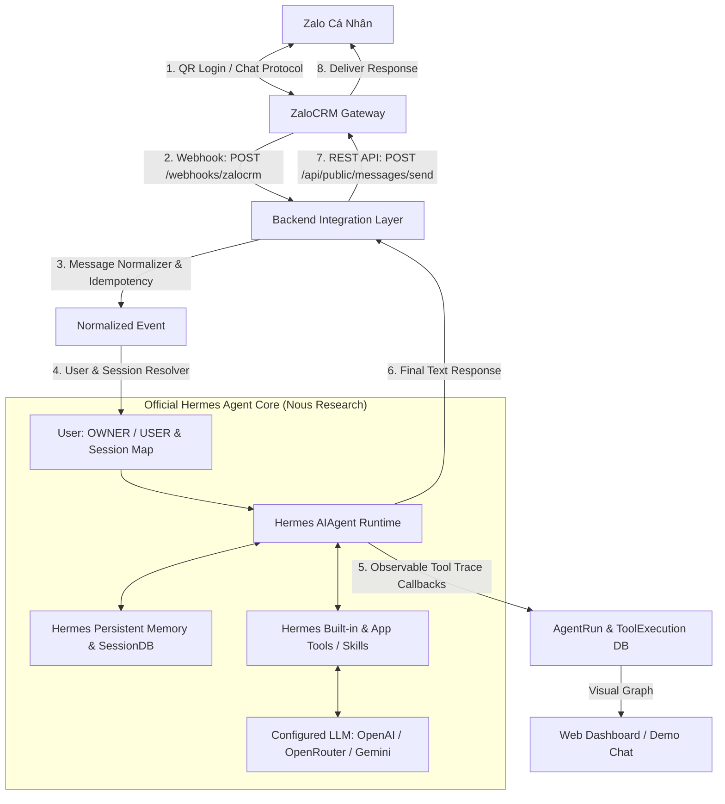

# KẾ HOẠCH DI TRÚ SANG ZALOCRM LÀM ZALO MESSAGING GATEWAY
# File: ZALOCRM_MIGRATION_PLAN.md

## 1. TỔNG QUAN MỤC TIÊU
- Sử dụng repository **ZaloCRM** (`https://github.com/locphamnguyen/ZaloCRM`) làm **Zalo Gateway / Messaging Infrastructure** chuyên trách cho việc kết nối Zalo cá nhân (đăng nhập QR, lưu session, reconnect, nhận webhook và gửi tin qua REST API).
- **Hermes Agent (Nous Research)** tiếp tục là **Bộ não AI duy nhất** của hệ thống xử lý toàn bộ logic hội thoại, bộ nhớ, công cụ (Tools), kỹ năng (Skills) và Multi-step Autonomous Loop.
- **TUYỆT ĐỐI KHÔNG** sử dụng AI Assistant tích hợp sẵn của ZaloCRM. ZaloCRM chỉ làm tầng giao tiếp tin nhắn (I/O).

---

## 2. KIẾN TRÚC MỤC TIÊU (FINAL TARGET ARCHITECTURE)

---

## 3. PHÂN LOẠI CÁC MODULE HIỆN TẠI (KEEP / REMOVE / REPLACE / ADAPT)

### 3.1. KEEP (Giữ lại)
- **Official Hermes Agent Runtime**: `vendor/hermes-agent/` (`run_agent.py`, `agent/conversation_loop.py`, `hermes_state.py`, `agent/memory_manager.py`).
- **Hermes Service Bridge**: `backend/app/agent/hermes_service.py` (quản lý session, RBAC context, observable trace callbacks).
- **Database Models & Storage**:
  - `backend/app/models/user.py`: User, phân quyền `OWNER` vs `USER`.
  - `backend/app/models/conversation.py`, `message.py`.
  - `backend/app/models/task.py`, `note.py`, `memory.py`.
  - `backend/app/models/agent_run.py`, `tool_execution.py`: Lưu trace thực thi phục vụ hiển thị Dashboard.
- **Frontend Dashboard (React + TypeScript + Vite)**:
  - `frontend/src/pages/DemoChat.tsx`: Môi trường giả lập test trực tiếp.
  - `frontend/src/pages/AgentRuns.tsx`: Trace Visualizer chi tiết từng bước gọi tool của Hermes.
  - `frontend/src/pages/Dashboard.tsx`: Hiển thị trạng thái Hermes Agent + ZaloCRM Gateway.

### 3.2. REMOVE (Xóa bỏ)
- ❌ Code Zalo SDK custom cũ / Zalo OA legacy (nếu không còn dùng):
  - `backend/app/channels/zalo/client.py` (legacy OA OpenAPI v3 client).
  - `backend/app/channels/zalo/adapter.py` (legacy OA adapter).
- ❌ Endpoint webhook Zalo OA cũ: `backend/app/api/routes/webhook.py` (chuyển sang webhook ZaloCRM).

### 3.3. REPLACE_WITH_ZALOCRM (Thay thế bằng ZaloCRM)
- ✅ Toàn bộ hạ tầng kết nối Zalo cá nhân (QR Login, session persistence, reconnect, message listener) ➔ Do **ZaloCRM Gateway** đảm nhận.
- ✅ Giao thức gửi tin nhắn ra Zalo ➔ Gọi qua **ZaloCRM Public REST API** (`POST /api/public/messages/send`).

### 3.4. ADAPT (Điều chỉnh để tích hợp ZaloCRM)
- 🔄 **`backend/app/channels/zalocrm/adapter.py` & `client.py`**:
  - `ZaloCRMClient`: Gọi ZaloCRM REST API (`POST /api/public/messages/send`, `GET /health`, `GET /api/public/conversations`).
  - `ZaloCRMAdapter`: Chuẩn hóa webhook payload từ ZaloCRM (`message.received`) thành `NormalizedMessage`.
- 🔄 **`backend/app/api/routes/zalocrm_webhook.py`**:
  - Endpoint `POST /webhooks/zalocrm` tiếp nhận event từ ZaloCRM, verify HMAC-SHA256 signature, deduplicate bằng `messageId`, chuyển tiếp vào Hermes Agent và gọi ZaloCRM API gửi câu trả lời.
- 🔄 **`backend/app/config/settings.py`**:
  - Bổ sung `ZALOCRM_BASE_URL`, `ZALOCRM_API_KEY`, `ZALOCRM_WEBHOOK_SECRET`, `ZALOCRM_DEFAULT_ACCOUNT_ID`.

---

## 4. LỘ TRÌNH THỰC HIỆN TỪNG BƯỚC

1. **Bước 1**: Lập `ZALOCRM_MIGRATION_PLAN.md` (Tài liệu này).
2. **Bước 2**: Nghiên cứu source ZaloCRM & viết `docs/ZALOCRM_INTEGRATION.md`.
3. **Bước 3**: Cấu hình và chạy ZaloCRM độc lập (Docker / Standalone).
4. **Bước 4**: Xây dựng `ZaloCRMClient` & `ZaloCRMAdapter`.
5. **Bước 5**: Chuẩn hóa Internal Message Format.
6. **Bước 6**: Xây dựng Webhook endpoint `POST /webhooks/zalocrm`.
7. **Bước 7**: Nối Webhook vào Hermes Agent Core.
8. **Bước 8**: Mapping Session & User Isolation (User A vs User B).
9. **Bước 9**: Kiểm tra Memory Hermes qua ZaloCRM flow.
10. **Bước 10**: Kiểm tra Hermes Tools & Skills qua ZaloCRM flow.
11. **Bước 11**: Kiểm tra phân quyền `OWNER` vs `USER`.
12. **Bước 12**: Tích hợp gửi phản hồi qua `POST /api/public/messages/send`.
13. **Bước 13**: Cập nhật Connection Status của ZaloCRM trên Dashboard.
14. **Bước 14**: Dọn dẹp code Zalo cũ.
15. **Bước 15**: Chạy toàn bộ test suite Pytest xác minh 100% kịch bản.
16. **Bước 16**: Cập nhật `README.md` & `ARCHITECTURE.md`.
